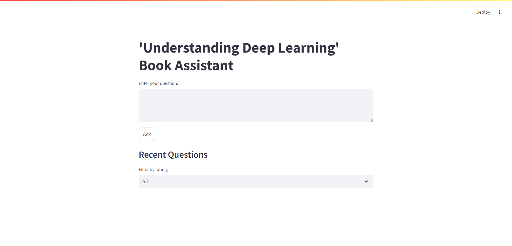
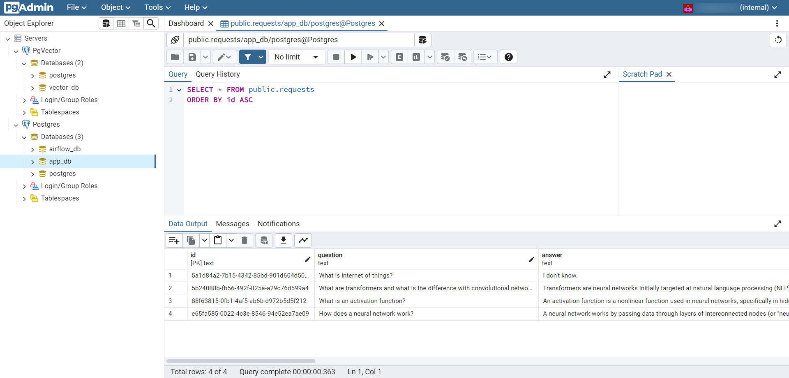
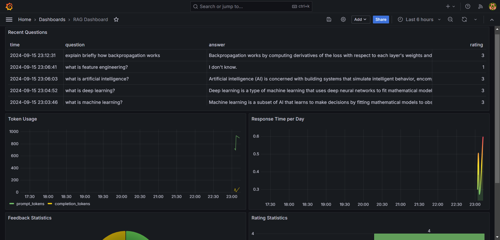

# Ask The Book "Understanding Deep Learning"


## Table of Contents
- [Project Overview](#project-overview)
- [Dataset](#dataset)
- [Technologies](#technologies)
- [Preparation](#preparation)
- [Running the Application](#running-the-application)
- [Using the Application](#using-the-application)

## Project Overview

In the fast-evolving world of AI and deep learning, the volume and complexity of information make it challenging to keep up with the latest advancements. For students, researchers, and professionals, the ability to access accurate, concise, and relevant knowledge quickly is invaluable. Traditional methods of retrieving information, such as manually searching through textbooks or online resources, can be time-consuming and inefficient, particularly when dealing with vast amounts of material. This project aims to address that issue by building a **Retrieval-Augmented Generation (RAG)** model that allows users to interact directly with the knowledge contained in the book *"Understanding Deep Learning"*.

The core problem that this project tackles is the inefficiency of sifting through dense technical books or papers for specific information. Deep learning texts often cover a wide range of complex topics, making it hard to locate the exact piece of information relevant to a particular question or task. By using a RAG model, this project provides users with the ability to ask specific questions and receive clear, context-aware answers drawn directly from the book. This not only saves time but also ensures that the information is sourced from a reliable, vetted reference, reducing the risk of misinformation.

Moreover, in fast-paced fields like deep learning, staying updated with the latest and most accurate information is crucial for making informed decisions. The RAG model is particularly useful in educational settings where students need quick explanations or clarifications on difficult concepts. Similarly, professionals can use this tool to get on-demand insights, helping them stay productive and focus on problem-solving rather than searching for information. This approach also facilitates self-paced learning, allowing users to explore the content of *"Understanding Deep Learning"* interactively, according to their needs.

The model is designed to enhance accessibility by providing users with a simple interface where they can type in their questions. Instead of presenting the entire content of a chapter or section, the model retrieves and summarizes the most relevant portions of the text, offering concise yet comprehensive answers. This can be especially beneficial for people preparing for exams, developing projects, or conducting research, as it minimizes cognitive overload while maximizing learning efficiency.

By leveraging state-of-the-art tools and frameworks, this project not only simplifies access to deep learning knowledge but also demonstrates the practical application of RAG models in educational and professional contexts. With the ability to search through complex material and present results in an easily digestible format, this tool offers a new way to engage with technical books, making deep learning more approachable and easier to navigate.

## Dataset

The knowledge base for this project is the book *"Understanding Deep Learning"*. This book provides a comprehensive overview of deep learning concepts, techniques, and applications. You can explore the book [here](https://udlbook.github.io/udlbook/).

## Technologies

This project integrates multiple powerful tools and frameworks to create a robust RAG model:

- **Python**: The core programming language used for model development and integration.
- **Docker**: Containerizes the application to ensure consistent development and deployment environments.
- **LangChain**: Powers the interaction between the language model and external data sources.
- **Postgres**: Stores the text embeddings in an efficient, searchable format.
- **pgvector**: An extension for Postgres that enables vector similarity search, critical for retrieving relevant data.
- **Groq**: Provides high-speed inference acceleration for the language model.
- **Streamlit**: Serves as the user interface for interacting with the RAG model.
- **Grafana**: Monitors and visualizes performance metrics, ensuring the model operates efficiently.

## Preparation

1. Clone the repository to your local machine:
   ```bash
   git clone <repository_url>
   cd <repository_folder>
   ```

2. Set up the Python virtual environment:
   ```bash
   python3 -m venv venv
   source venv/bin/activate
   pip install -r requirements.txt
   ```

3. Obtain a Groq API Key by signing up at [Groq](https://groq.com). 

4. Obtain a Hugging Face API Token by signing up at [Hugging Face](https://huggingface.co/).

5.  Create a .env file in the project directory. Use the example.env file as a guide to understand which environment variables need to be set. Update the values according to your environment and API keys from previous steps.

    ```bash
    cp example.env .env
    # Then edit the .env file with your specific configurations
    ```

## Running the Application

> **_NOTE:_** Keep images names and tags as is defined, so you won't need to update anything else in the project.

1. Build the Docker images for the application:
   ```bash
   docker build -t docloader_task:latest -f services/docloader/Dockerfile services/docloader
   docker build -t rag_app:v1 -f services/app/Dockerfile services/app
   docker build -t grafana_init:v1 -f services/grafana_init/Dockerfile services/grafana_init
   ```

2. Initialize airflow:
   ```bash
   docker-compose up airflow-init
   ```

3. Run the application using Docker Compose:
   ```bash
   docker-compose up -d
   ```

> **_NOTE:_** Deploying the entire stack takes about 10 minutes while all checks and configurations are completed.

## Using the Application

> **_NOTE:_** The process of ingesting the book into the vector database can take approximately up to 30 minutes, depending on your system's performance. Please be patient and wait for the DAG to complete the ingestion task before starting to use the app. You can check the status of the ingestion DAG in the Airflow interface to ensure the process has finished.

Once the application is up and running, you can access it by opening your web browser and navigating to:

```
http://localhost:8501
```

This will bring up the Streamlit-based user interface, where you can enter questions about deep learning. The RAG model will retrieve relevant information from the *"Understanding Deep Learning"* book and generate helpful responses.



You can also check the status of the book's load to vector database in Airflow by navigating to:

```
http://localhost:8080
```

Using the credentials configured in the .env file, you will enter the airflow interface and be able to see the status of the ingest dag:


If you want to review the databases and how the information is being stored, you can access both Postgres and PGVector services through PgAdmin by navigating to:

```
http://localhost:8888
```

Using the credentials from the `.env` file, you will log into PgAdmin. After configuring access to the services, you will be able to see their status:



For more information on how to create a connection, you can refer to [this guide](https://www.pgadmin.org/docs/pgadmin4/development/connecting.html).

The application also integrates Grafana, a powerful monitoring and visualization tool. Grafana allows users to track performance metrics of the RAG model and the underlying infrastructure, ensuring that the application operates efficiently. Users can access the Grafana dashboard by navigating to:

```
http://localhost:3000
```

To log in, use the username and password defined in the .env file. Upon the first login, Grafana may prompt you to change the default password as a security measure.

> **_NOTE:_** If prompted, please follow the instructions to set a new password for your Grafana account to enhance the security of your monitoring dashboard.



Grafana allows users to track essential performance metrics of the RAG model, such as query response times, token usage, the rating of responses according to the LLM judge, and user feedback. These metrics help ensure that the model is delivering high-quality, efficient responses.